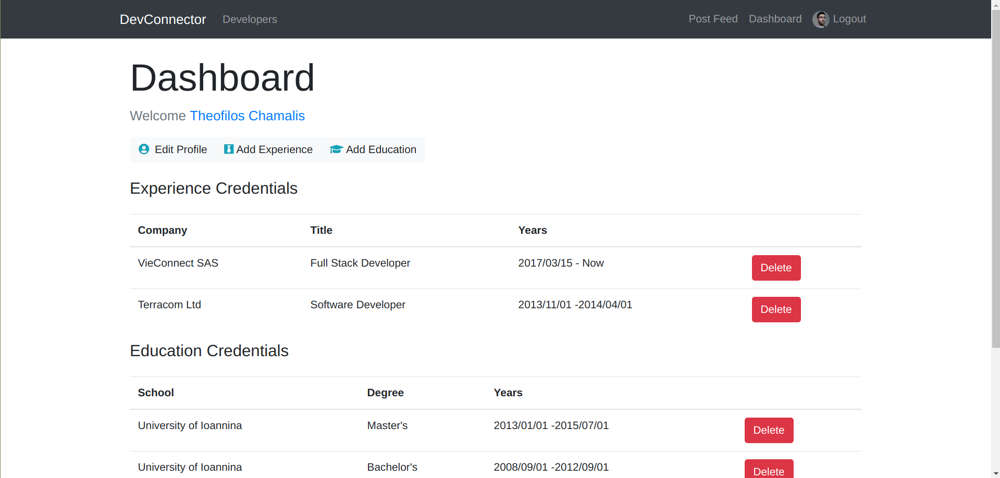
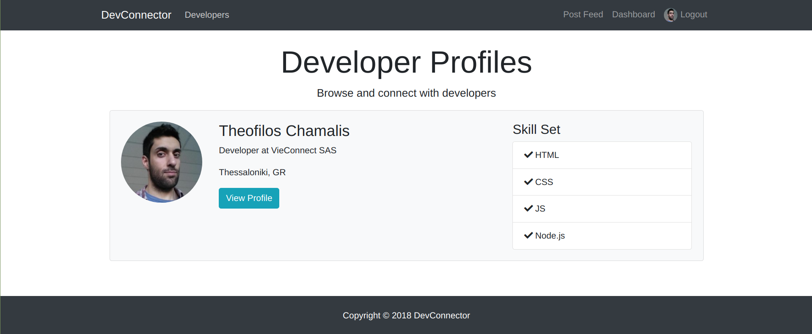
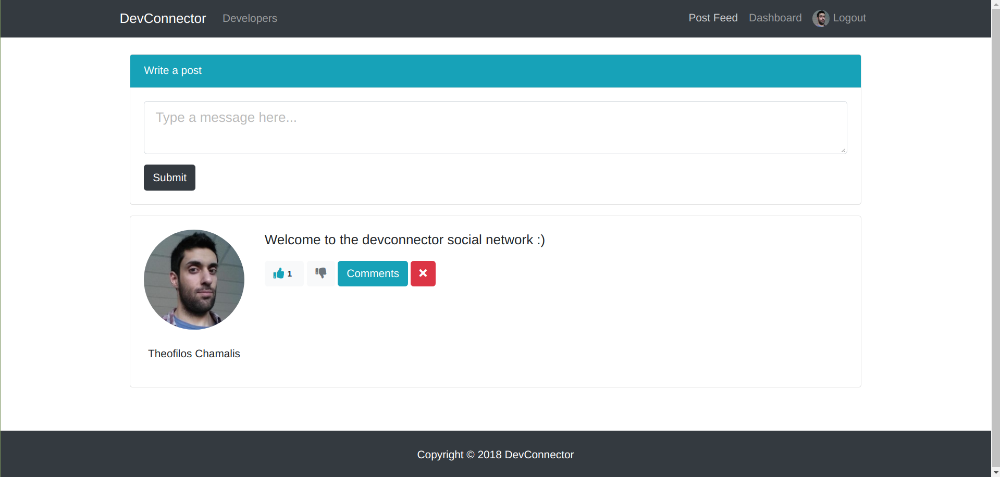

# Dev Connector

A social resume platform for developers. Create your portofolio by adding experience, education, skills or any important information of your career and post your comments or thoughts for other users.

This is a MERN based full stack real world bootstrapping application that can speed up the development process. It uses the popular MongoDB database with Mongoose schemas, the backend web framework Express.js, the frontend library Preact.js which is a lightweight variant of React.js and Node.js. Authentication is performed using JSON Web Tokens together with the Passport middleware.

Visit it at: <a href="https://thedevconnector.herokuapp.com" target="_blank"> https://thedevconnector.herokuapp.com</a>

## Screenshots

<h3>Home Page</h3>


<br>
<h3>Profile Dashboard</h3>


<br>
<h3>Users Profiles</h3>


<br>
<h3>Post Feed</h3>


---
<br>

## Quick Start

```bash
# clone repository
https://github.com/Theofilos-Chamalis/DevConnector.git

# Install dependencies
cd devConnector && npm run install-all

# Enter your development & production MongoDB URI & JWT key
Directory: config/
```

To run the development server on both backend and frontend:

```bash
# The development server runs on port 3000
npm run dev
```

To run only the backend

```bash
# The backend server runs on port 5000
npm run backend
```

To run only the frontend client
```
# The frontend client runs on port 3000
npm run client
```

To lint the whole project with eslint
```
# You can also change the eslint rules stored in.eslintrc
npm run lint
```

## Technologies & Libraries Used

### Client Side

- [x] **[preact.js](https://github.com/preactjs/preact)**
- [x] **[redux](https://github.com/reactjs/redux)**
- [x] **[bootstap 4](https://github.com/twbs/bootstrap/tree/v4-dev)**
- [x] **[react-router-dom](https://github.com/ReactTraining/react-router/tree/master/packages/react-router-dom)**
- [x] **[axios](https://github.com/axios/axios)**
- [x] **[classnames](https://github.com/JedWatson/classnames)**
- [x] **[dayjs](https://github.com/iamkun/dayjs)**
- [x] **[react-redux](https://github.com/reduxjs/react-redux)**
- [x] **[redux-thunk](https://github.com/reduxjs/redux-thunk)**
- [x] **[validator](https://github.com/chriso/validator.js)**

### Server Side

- [x] **[node.js with express](https://github.com/expressjs/express)**
- [x] **[mongoDB](https://github.com/mongodb/mongo)**
- [x] **[jwt](https://github.com/auth0/node-jsonwebtoken)**
- [x] **[passport](http://www.passportjs.org/)**
- [x] **[passport-jwt](https://github.com/themikenicholson/passport-jwt)**
- [x] **[bcryptjs](https://github.com/dcodeIO/bcrypt.js)**
- [x] **[compression](https://github.com/expressjs/compression)**
- [x] **[helmet](https://github.com/helmetjs/helmet)** 
- [x] **[gravatar](https://github.com/emerleite/node-gravatar)**
- [x] **[mongoose](http://mongoosejs.com/)**
- [x] **[jwt-decode](https://github.com/auth0/jwt-decode)**
- [x] **[validator](https://github.com/chriso/validator.js)**
